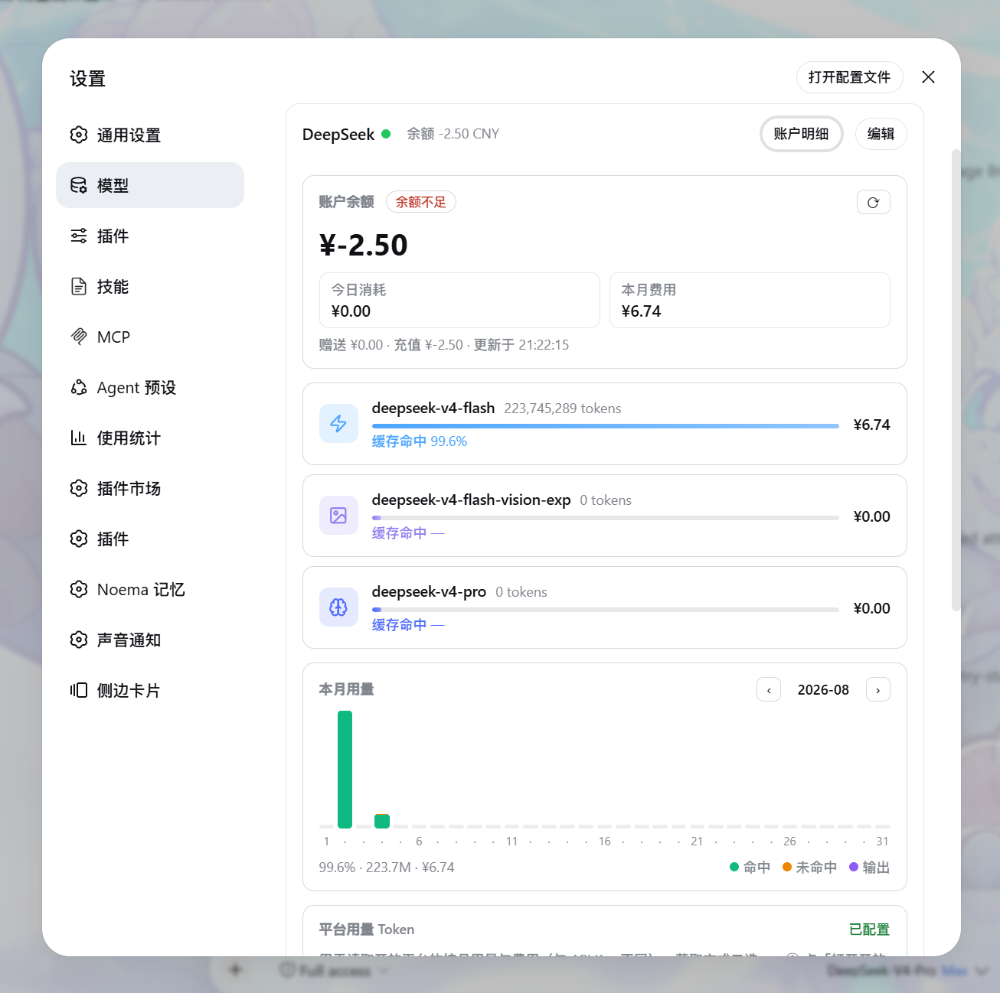

# DSH Deepseek Monitor

[English](./README_EN.md) | 简体中文

[](https://www.npmjs.com/package/dsh-deepseek-monitor)
[](https://www.npmjs.com/package/dsh-deepseek-monitor)
[](./LICENSE)
[](https://www.typescriptlang.org/)
[](https://github.com/DeepSeek-ai/DeepSeek-Harness)
[](https://nodejs.org/)

DeepSeek Harness（dsh）Web 插件：把 [DeepSeekMonitorWindows](https://github.com/Joyi-code/DeepSeekMonitorWindows) 的**余额与用量监控**能力移植进 dsh —— 集成到「设置 → 模型 → DeepSeek」供应商卡片内，并在对话统计带显示实时余额。



> 截图：设置 → 模型 → DeepSeek 卡片展开的「账户明细」面板（余额卡 / 模型用量行 / 每日堆叠柱状图），以及名称旁的余额 chip 与「账户明细」按钮。

## 功能特性

### 设置 · 模型 · DeepSeek 行内增强

- **「账户明细」按钮**：位于「编辑」左侧，克隆宿主按钮样式，视觉完全一致
- **余额 chip**：模型名称旁实时显示余额（按币种渲染符号，如 ¥/$），低于阈值变红
- **展开面板**（点击按钮在卡片容器内展开）：
  - **账户余额**：官方 `GET /user/balance` API，复用 dsh 已配置的密钥；今日消耗 / 本月费用 mini 格；低余额警示
  - **模型用量行**：固定顺序 Flash → Vision → Pro，平台全称显示、lucide SVG 图标（闪电 / 照片 / 大脑）、独立柔和配色（天蓝 / 雾紫 / 品牌蓝）、进度条 + 缓存命中率 + 费用，行高恒定
  - **每日堆叠柱状图**：DSM 原版配色（命中绿 / 未命中橙 / 输出紫），月份切换，稀疏日期标注保证不重叠，自绘悬浮卡（悬停查看明细）
  - **平台 Token 配置**：双通道获取——①一键复制控制台抓取脚本（登录平台页粘贴回车即捕获）；②手动 F12 粘贴。保存前先经平台接口验活，凭据只写不读回
  - **设置**：自动刷新开关与间隔（≥60s）、低余额提醒与阈值、重载缓存 / 清除缓存

### 对话统计带余额项

- 挂载于官方 `conversation.composer.dock` 槽位，与轮数步数 / 耗时 / 缓存命中率等统计项**同一行、同排版**
- 仅在使用 DeepSeek 官方模型的会话中显示，跟随统计带出现与消失
- 刷新节奏由上方设置中的自动刷新间隔统一驱动

## 数据与安全

- API Key 通过 dsh 凭据缝每次操作现解析，插件不存储、不上屏、不入日志
- 平台 Token 经自有 fenced 路由写入 dsh 凭据缝（write-only），任何接口不回显
- 全部路由位于浏览器信任围栏之后（loopback / trustedHosts，拒绝跨站）
- 抓取脚本纯本地运行于平台页自身上下文，不向任何第三方发送数据
- 偏好与缓存持久化于 storage-domain `deepseek_monitor`

## 安装

```sh
# npm 发布后可用
dsh plugin --profile <name> add dsh-deepseek-monitor@latest
```

> 当前尚未发布 npm。可克隆本仓库 `pnpm build` 后，将产物目录通过本地 profile / 注入器方式装载。

## 开发

```sh
pnpm install
pnpm typecheck   # tsc --noEmit
pnpm test        # vitest run
pnpm build       # tsc declarations + tsdown (host ESM + 双通道 client bundle)
pnpm watch       # tsdown --watch
```

GUI 取证脚本（无头浏览器验证面板挂载与样式）：`node scripts/probe-gui.mjs`

## 致谢

本插件的余额 / 平台用量后端与面板结构，移植自作者自己的 [HaoyueQin/DeepSeekMonitorWindows](https://github.com/HaoyueQin/DeepSeekMonitorWindows)（Windows 桌面版）；移植所依据的实现沿其自述谱系继续向上追溯：

| 项目 | 关系 | 许可证 |
| --- | --- | --- |
| [HaoyueQin/DeepSeekMonitorWindows](https://github.com/HaoyueQin/DeepSeekMonitorWindows) | **直接移植来源**：`do_fetch_balance` / `do_fetch_usage` / token 口径与仪表盘结构的 TypeScript 移植底本 | MIT |
| [Joyi-code/DeepSeekMonitorWindows](https://github.com/Joyi-code/DeepSeekMonitorWindows) | 上述桌面版的**直接上游**（Windows Tauri 2 重构），移植逻辑的最终出处 | MIT |
| [JayHome137/DeepSeekMonitor](https://github.com/JayHome137/DeepSeekMonitor) | 谱系起点（macOS 菜单栏 + WidgetKit 版），开创了「DeepSeek 余额与用量监控」这一形态 | MIT |
| [lucide](https://lucide.dev/) | SVG 图标库 | ISC |

> 注：上游 HaoyueQin/DeepSeekMonitorWindows 的 README 曾一度将 Joyi-code 上游误标为 felikschu/deepseek-monitor（一个 Python 编写的 DeepSeek **平台变化追踪**系统，与余额/用量监控无关），并已在更正说明中澄清。该仓库与本插件无任何代码复用关系。

本项目基于 [MIT](./LICENSE) 发布，上述 MIT 项目许可声明随分发一并保留。

## License

MIT
