# DSH DeepSeek Monitor

English | [简体中文](./README.md)

<p align="center">
  <picture>
    <source media="(prefers-color-scheme: dark)" srcset="docs/banner-dark.svg">
    
  </picture>
</p>

[](https://www.npmjs.com/package/dsh-deepseek-monitor)
[](https://www.npmjs.com/package/dsh-deepseek-monitor)
[](./LICENSE)
[](https://www.typescriptlang.org/)
[](https://github.com/DeepSeek-ai/DeepSeek-Harness)
[](https://nodejs.org/)
[](https://github.com/HaoyueQin/dsh-deepseek-monitor/graphs/commit-activity)
[](https://github.com/HaoyueQin/dsh-deepseek-monitor/commits)

A DeepSeek Harness (dsh) web plugin that ports the **balance & usage monitoring** of [DeepSeekMonitorWindows](https://github.com/HaoyueQin/DeepSeekMonitorWindows) into dsh — embedded in the "Settings → Models → DeepSeek" provider card, with a live balance item in the composer tool row (left of the model name).

<p align="center">
  
</p>

<p align="center">
  
</p>

> Screenshot: the "Account details" panel expanded inside the DeepSeek provider card (balance card / per-model usage rows / daily stacked chart), plus the balance chip and the "Account details" button next to the row name.

## Features

### Inline in Settings · Models · DeepSeek

- **"Account details" button**: sits left of the built-in Edit button, cloned from the host button styling for pixel parity
- **Balance chip**: live balance next to the model name, rendered with the currency's symbol (¥/$/…); turns red below the threshold
- **Expanded panel**:
  - **Account balance**: official `GET /user/balance` API reusing the key already configured in dsh; today / month-to-date mini metrics (rendered in the account currency, falling back to ¥ without a balance snapshot); low-balance warning
  - **Per-model usage rows**: fixed order Flash → Vision → Pro, full platform ids, lucide SVG icons (bolt / image / brain), per-model soft accents (sky / lavender / brand blue), progress bar + cache-hit rate + cost, constant row height
  - **Daily stacked chart**: DSM's own palette (hit green / miss orange / response purple), month navigation, sparse date labels that never collide, custom styled hover cards
  - **Platform token setup**: two acquisition channels — ① one-click console capture script (paste on the signed-in platform page, token pops up); ② manual paste via DevTools. Verified against the platform API before being stored write-only
  - **Settings**: composer balance display switch, auto-refresh toggle & interval (≥60s), low-balance alert & threshold, reload / clear cache

### Composer tool-row balance item

- Mounted on the official `conversation.input.right` slot — rendered **left of the model name, before the send button**, matching the sibling controls' typography (28px height / 13px font / medium weight)
- Shown only while the session's latest route's PROVIDER is the built-in official DeepSeek provider (the fixed first entry in Settings → Models; route id `deepseek-official`) — keyed on the provider, never the model name, so a third-party provider serving a `deepseek-*`-named model does not light it up; hidden on the session-less hero screen
- A switch in the "Account details → Settings" card turns this composer display on / off; the composer responds immediately after saving
- Coloring policy: the currency symbol keeps the neutral gray; the NUMBER turns green above zero (`state-success-primary`) and red at or below zero (`state-error-primary`)
- The chip polls the host cache every 60s and the expanded panel follows the configured interval; actual upstream refreshes are driven by the auto-refresh interval above (≥60s — only the host-side timer ever calls upstream)

## Data & security

- The API key is resolved per operation through the dsh credentials seam — never stored, echoed or logged by this plugin
- The platform token is written into the credentials seam through our fenced route (write-only); no endpoint returns it
- Every route lives behind the browser trust fence (loopback / trustedHosts; cross-site refused)
- The capture script runs locally inside the platform page's own context and sends nothing anywhere
- Preferences and cache persist in the storage domain `deepseek_monitor`

## Install

```sh
dsh plugin --profile <name> add dsh-deepseek-monitor@latest
```

> Published on npm: [dsh-deepseek-monitor](https://www.npmjs.com/package/dsh-deepseek-monitor). Alternatively, download `dsh-deepseek-monitor-<version>.tgz` from [GitHub Releases](https://github.com/HaoyueQin/dsh-deepseek-monitor/releases) and mount it via a local profile / injector.

## Development

```sh
pnpm install
pnpm typecheck   # tsc --noEmit
pnpm test        # vitest run
pnpm build       # tsc declarations + tsdown (host ESM + dual-channel client bundle)
pnpm watch       # tsdown --watch
```

Headless GUI verification script: `node scripts/probe-gui.mjs`

## Acknowledgements

The balance / platform-usage backend and the dashboard structure were ported from the author's own [HaoyueQin/DeepSeekMonitorWindows](https://github.com/HaoyueQin/DeepSeekMonitorWindows) (the Windows desktop app); the implementation that port follows continues upstream along that repo's own stated lineage:

| Project | Relationship | License |
| --- | --- | --- |
| [HaoyueQin/DeepSeekMonitorWindows](https://github.com/HaoyueQin/DeepSeekMonitorWindows) | **Direct port source**: the TypeScript port base for do_fetch_balance / do_fetch_usage, the token semantics and the dashboard structure | MIT |
| [Joyi-code/DeepSeekMonitorWindows](https://github.com/Joyi-code/DeepSeekMonitorWindows) | **Direct upstream** of that desktop app (the Windows Tauri 2 rebuild) — where the ported logic ultimately comes from | MIT |
| [JayHome137/DeepSeekMonitor](https://github.com/JayHome137/DeepSeekMonitor) | Origin of the lineage (macOS menu-bar + WidgetKit), which pioneered DeepSeek balance & usage monitoring | MIT |
| [lucide](https://lucide.dev/) | SVG icon library | ISC |

Released under [MIT](./LICENSE); the MIT notices of the projects above are preserved with any distribution.

## Activity

[](https://gitstock.org/HaoyueQin/dsh-deepseek-monitor)

## License

MIT
